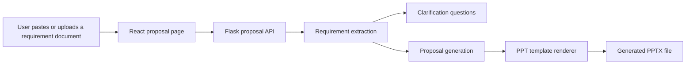

# System Map
## High-Level Flow

## Main Building Blocks

- React frontend
- Flask proposal API
- proposal agent logic
- template-driven PPT renderer
- local generated-file storage

## Provider Layers

- Gemini API when `GEMINI_API_KEY` is set
- deterministic local fallback when no API key is available

## Storage Layers

- local source upload handling
- local `generated/` output for PPTX files
- template files under `templates/`
